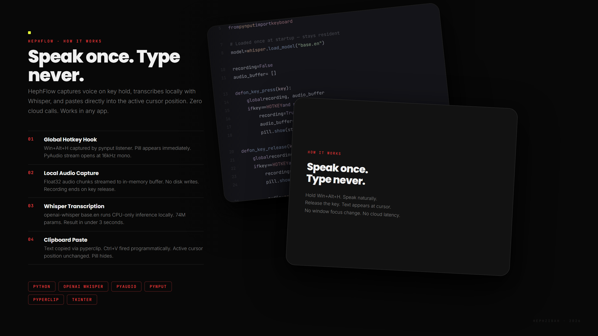
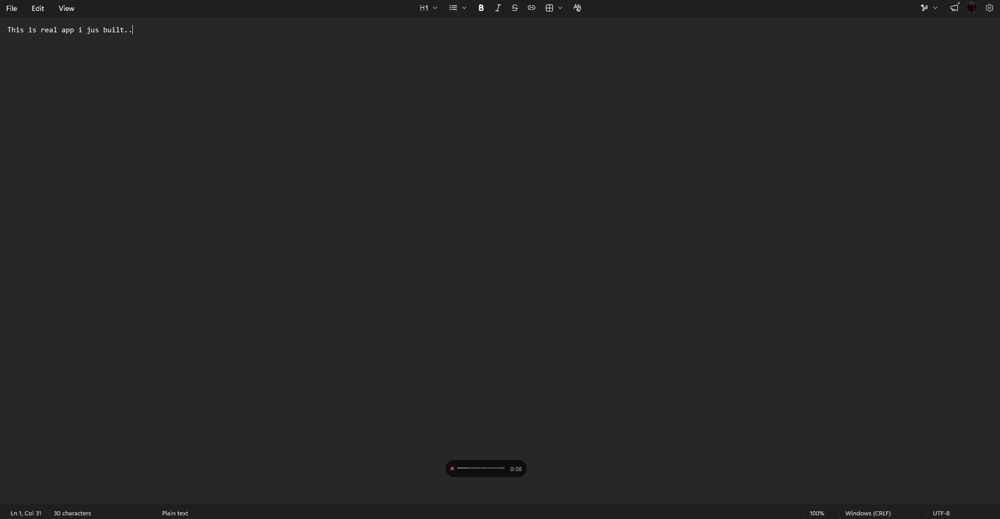
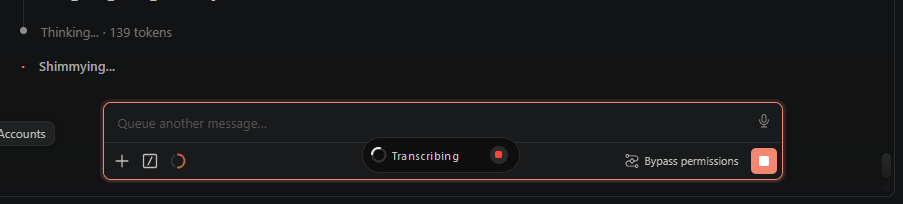
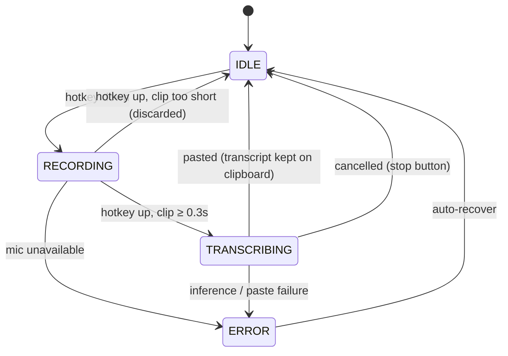
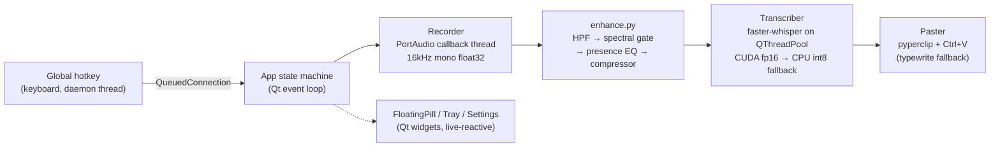
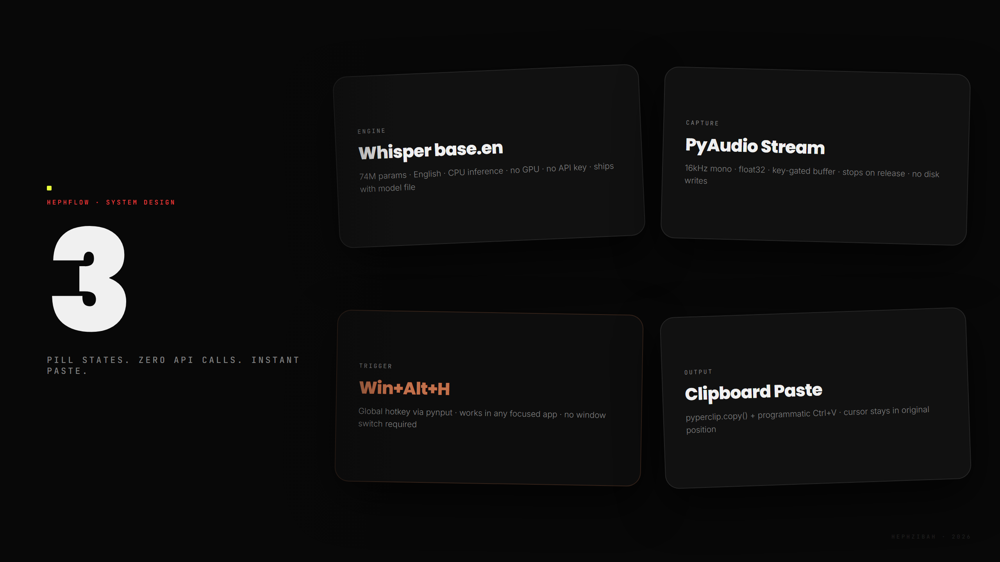
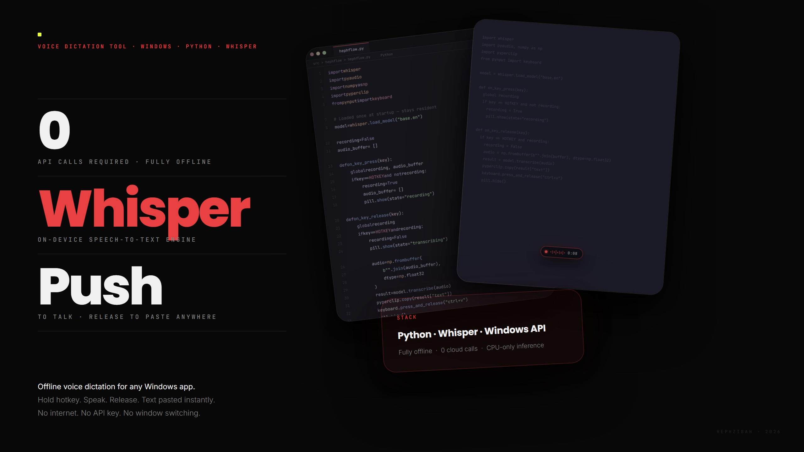

<div align="center">

# HephFlow

**Local-first, push-to-talk speech-to-text for Windows.**

Hold a hotkey, speak, release — your words are transcribed on-device and pasted
at the cursor in any application. No cloud. No account. No subscription.

[](#requirements)
[](#requirements)
[](#architecture)
[](#overview)
[](LICENSE)

<br>



</div>

---

## Overview

HephFlow is the open, offline answer to tools like WhisperFlow and Superwhisper:
a floating pill UI, push-to-talk recording, local Whisper transcription, and
instant paste — running entirely on your machine. Your audio never touches a
server, a queue, or a third-party API — it goes from your microphone to a
model resident in your own RAM and back out through the Windows clipboard.

This isn't a wrapper around a cloud endpoint. The whole pipeline — capture,
DSP cleanup, inference, and injection — runs in-process, on-device, and is
small enough to read end to end in an afternoon.

- 🎙️ **Push-to-talk** — hold a global hotkey, speak, release.
- ⚡ **Fast & accurate** — `distil-medium.en` by default (near-`medium`
  accuracy at a fraction of the cost), CUDA when available, int8-quantized
  multi-core CPU inference otherwise.
- 🔒 **100% offline** — after the one-time model download, zero network calls.
- 🧠 **Voice enhancement** — a from-scratch DSP stage (FIR high-pass,
  spectral-subtraction noise gate, presence EQ, soft-knee compression) cleans
  the mic signal before it ever reaches the model.
- 🪟 **Floating pill** — a compact, matte, non-focus-stealing overlay with a
  live, voice-reactive waveform.
- 🔊 **Tactile sound cues** — subtle, synthesized start/done/error tones.
- 🛟 **Never lose a transcript** — the text stays on your clipboard after
  pasting, so a mis-aimed paste is always recoverable with `Ctrl+V`.
- ⚙️ **Live settings** — change hotkey, model, language, and more with no
  restart, and no dropped keystrokes mid-swap.

---

## In action

<table>
<tr>
<td width="50%">

<p align="center"><sub>The pill mid-recording — live, voice-reactive waveform, no window focus stolen from the app underneath.</sub></p>
</td>
<td width="50%">

<p align="center"><sub>Same hotkey, same pipeline, dropped straight into a terminal chat prompt — HephFlow doesn't care what's focused.</sub></p>
</td>
</tr>
</table>

---

## How it works



1. Hold the hotkey (default: **Right Alt**, falls back to **F13** if the
   registration conflicts) and speak.
2. Release. The pill shows a live waveform, then a spinner while
   `faster-whisper` transcribes off the UI thread.
3. The text is pasted at your cursor and the pill snaps away.

Press **Ctrl+Z** right after a paste to undo it as a single action, or
**Ctrl+V** to paste again — the transcript stays on the clipboard by design.

---

## Architecture



| Module | Responsibility |
|---|---|
| [`main.py`](main.py) | Orchestrator + state machine, hotkey listener, signal wiring |
| [`recorder.py`](recorder.py) | Mic capture (sounddevice), 30 fps level metering |
| [`transcriber.py`](transcriber.py) | faster-whisper inference on a worker pool |
| [`enhance.py`](enhance.py) | Voice-enhancement DSP (numpy: HPF, noise gate, EQ, compressor) |
| [`paster.py`](paster.py) | Clipboard inject + Ctrl+V, with typewrite fallback |
| [`pill.py`](pill.py) | Floating overlay (matte pill, reactive waveform, spinner) |
| [`tray.py`](tray.py) | System tray icon + menu |
| [`settings.py`](settings.py) | Settings window |
| [`sounds.py`](sounds.py) / [`gen_sounds.py`](gen_sounds.py) | Sound playback / synthesis |
| [`config.py`](config.py) | Config dataclass + atomic JSON persistence |

<div align="center">

</div>

### Engineering highlights

These are the details that separate "it works" from "it's correct under
concurrency" — worth calling out because they're easy to get wrong:

- **Real-time-safe audio thread.** PortAudio's callback runs on its own
  low-latency thread and does exactly one thing — copy the incoming block into
  a list. No Qt calls, no logging, no allocation surprises on the hot path
  ([`recorder.py`](recorder.py)).
- **Cross-thread marshaling, not shared state.** The global keyboard hook
  lives on a daemon thread outside Qt's control; every callback crosses into
  the Qt event loop via `QMetaObject.invokeMethod(..., QueuedConnection)`
  rather than touching Qt objects directly from a foreign thread
  ([`main.py`](main.py)).
- **Cancellation via generation counter, not thread interruption.**
  `faster-whisper` inference can't be interrupted mid-call — so instead of
  fighting that, `Transcriber` bumps a generation counter on cancel and drops
  any in-flight result whose generation is stale. The compute finishes; it
  just never gets pasted ([`transcriber.py`](transcriber.py)).
- **Hotkey degrades gracefully.** If the configured hotkey can't be
  registered (already bound elsewhere, driver quirk), `HotkeyListener` falls
  back to `F13` automatically rather than leaving the app silently dead
  ([`main.py`](main.py)).
- **DSP that's actually DSP, not a noise-reduction library import.**
  `enhance.py` is a from-scratch numpy pipeline: a windowed-sinc FIR
  high-pass (spectral inversion from a low-pass prototype) to kill rumble
  below 85 Hz, a framed FFT spectral-subtraction noise gate (15th-percentile
  per-bin noise floor, over-subtracted and floored to avoid musical noise,
  smoothed across time, reconstructed via overlap-add), a presence-band EQ
  lift around 3.5 kHz for consonant clarity, and a soft-knee compressor —
  all vectorized so a 30-second clip processes in single-digit milliseconds.
- **Inference fallback chain.** `Transcriber.load_model()` tries CUDA
  `float16` first and falls back to CPU `int8` pinned to `os.cpu_count()`
  threads — no user-facing flag needed, no crash if there's no GPU.
- **Paste is a single undoable action, and the clipboard is a safety net.**
  `Paster` copies with retries (some apps briefly hold clipboard ownership),
  fires a programmatic `Ctrl+V`, and — unless you opt into restoring the
  previous clipboard — deliberately *leaves the transcript on the clipboard*.
  A mis-aimed paste is never a lost transcript ([`paster.py`](paster.py)).
- **Settings apply live, correctly.** Changing the model swaps the
  `Transcriber` instance and reloads on a worker thread without racing an
  in-flight recording; changing the hotkey re-registers without restart. No
  setting requires relaunching the app ([`main.py: apply_settings`](main.py)).

Threading, end to end: the keyboard listener owns one daemon thread; audio
capture owns PortAudio's real-time thread; model loading runs on a dedicated
`QThread`; every transcription is a `QRunnable` on the global `QThreadPool`.
Everything else — state transitions, the pill, the tray, settings — lives on
the Qt event loop and communicates exclusively through signals/slots.

---

## Requirements

| | |
|---|---|
| **OS** | Windows 10 (22H2+) or Windows 11 |
| **Python** | 3.10 – 3.13 (to run from source) |
| **RAM** | 4 GB+ (the model uses ~300 MB–1 GB depending on size) |
| **GPU** | Not required — CPU inference. (Optional NVIDIA CUDA path.) |
| **Other** | A microphone; Microsoft Visual C++ Redistributable 2019+ |

---

## Install & run (from source)

```powershell
git clone https://github.com/m1r4g3-code/HephFlow.git
cd HephFlow
python -m venv .venv
.venv\Scripts\activate
pip install -r requirements.txt
python generate_icons.py   # one-time: builds tray icons
python gen_sounds.py       # one-time: builds sound effects
python main.py
```

### First-run model download

The default model (`distil-medium.en`, ~750 MB) is **not** bundled. On first use
faster-whisper downloads it to the HuggingFace cache
(`%USERPROFILE%\.cache\huggingface\hub`). This is a one-time download; afterwards
HephFlow is fully offline. You can pick a smaller model (`tiny`/`base`/`small`)
in Settings if you prefer a lighter footprint.

---

## Standalone executable

A single-file build is produced with PyInstaller:

```powershell
pip install pyinstaller
pyinstaller pressflow.spec
```

Output: `dist/HephFlow.exe`. The model still downloads (or is reused from cache)
on first run. See [`pressflow.spec`](pressflow.spec) for the bundling details.

---

## Usage

- **Tray icon** — grey mic (idle), red mic (recording), yellow triangle (error).
- **Right-click the tray** → Settings · Pause/Resume · About · Quit.
- **Double-click the tray** → open Settings.
- **Drag the pill** anywhere; its position is remembered.
- **Stop button** — click the square on the pill to cancel a transcription.

---

## Settings

All changes apply immediately — no restart.

| Setting | Notes |
|---|---|
| **Hotkey** | Click the field, then press a key (default: Right Alt) |
| **Model** | `tiny` / `base` / `small` / `medium` / `distil-*` |
| **Language** | ISO code (`en`, `fr`, …); blank = auto-detect |
| **Paste method** | `clipboard` (default) or `typewrite` |
| **Trailing space** | Append a space after the transcript |
| **Audio enhance** | Noise reduction + clarity DSP before transcription |
| **Sound effects** | Subtle start/done/error cues |
| **Startup** | Launch HephFlow when Windows starts |

Config lives in `config.json` next to the app — human-readable and
hand-editable. Corrupt or missing config is regenerated with defaults.

---

## Troubleshooting

- **Hotkey does nothing** — some antivirus tools flag the `keyboard` library as a
  key logger. Add an exclusion for HephFlow.
- **Paste fails in an elevated app** (Task Manager, an admin terminal) — Windows
  blocks input across that security boundary unless HephFlow is also run as
  administrator.
- **First transcription is slow** — the model loads into RAM at startup (a few
  seconds); subsequent transcriptions are fast.
- **Logs** — see `pressflow.log` next to the app (set `log_level` to `DEBUG` in
  `config.json` for verbose output).

---

## Roadmap

- DeepFilterNet neural noise suppression (optional)
- Spoken formatting commands ("new line", "comma")
- Transcript history in the tray
- Microphone picker in Settings
- GPU (CUDA) inference path

---

## License

Released under the MIT License. See [`LICENSE`](LICENSE).

---

<div align="center">


Built with faster-whisper · PyQt6 · sounddevice — offline, and owned by you.
</div>
